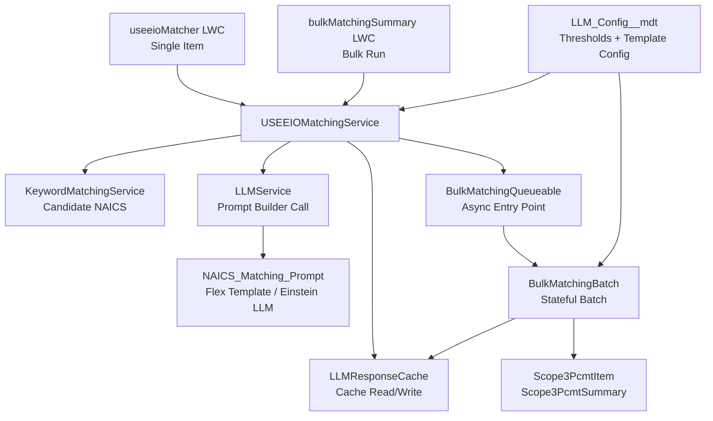

# 🌿 USEEIO Matching Agent

[](https://salesforce.com)
[](https://help.salesforce.com/s/articleView?id=sf.net_zero_cloud_intro.htm)
[](https://developer.salesforce.com/docs/platform/lwc/guide)

## The Problem

Completing a spend-based Scope 3 emissions inventory requires mapping every line of procurement spend to the right emissions factor. For most sustainability teams, that means working through a list of 1,016 possible NAICS industry codes — manually, one spending category at a time.

The process doesn't scale. A 500-line spend file is 500 individual lookups, each requiring judgment about which industry classification best fits a spending category. It is skilled, time-consuming work — and it is largely repeatable.

## The Solution

The USEEIO Matching Agent automates the bulk of that classification work. It narrows the field down to the most likely candidates using keyword matching, then uses Agentforce to identify the single best match for each spending category — along with a confidence score. High-confidence matches are applied automatically. Anything the system is less certain about is flagged for human review, so the sustainability manager stays in control of quality without having to touch every record.

The system runs entirely inside Salesforce Net Zero Cloud. No external tools, no data exports, no manual re-entry.

---

## 🚀 Quick Deploy

<div align="center">

[](https://githubsfdeploy.herokuapp.com?owner=salesforce-misc&repo=NZC-USEEIOMatchingAgent&ref=main)

**One-click deployment to your Salesforce org**

> **Note:** You may need to authenticate with your Salesforce org during deploy. Alternatively, use the [Salesforce CLI deployment method](#-option-3-salesforce-cli-deployment) below.

</div>

---

## ✨ Features

### 🤖 **Matching Intelligence**

- **Hybrid candidate selection**: Combines deterministic keyword filtering with Agentforce reasoning to improve NAICS mapping quality.
- **Alternative match suggestions**: Returns top candidates with confidence and reasoning for analyst review.
- **NAICS-aware behavior**: Uses NAICS 2017 definitions while supporting USEEIO model expectations.

### ⚡ **Bulk Processing**

- **Async bulk runs**: Processes entire procurement summaries via queueable + batch workflows.
- **Progress tracking**: Updates status and counts on summary records for UI polling.
- **Review-friendly output**: Stores match metadata to support analyst verification workflows.

### 💾 **Operational Efficiency**

- **Response caching**: Caches LLM outputs keyed by spending category combination and factor set to eliminate redundant callouts on repeated inputs.
- **In-batch deduplication**: Items with identical spending categories within a single bulk run share the same LLM result in memory — no duplicate API calls.
- **Configurable thresholds**: Auto-apply threshold, scoring weights, and LLM score mappings are stored in `LLM_Config__mdt` and adjustable without code redeployment.
- **Prompt-template driven**: Uses Salesforce Prompt Builder configuration via custom metadata.
- **Salesforce-native architecture**: Keeps UI thin and delegates all orchestration to Apex services.

---

## 🚀 Getting Started

### 📋 Prerequisites

Before you begin, ensure you have the following:

- ✅ **Salesforce org** with deployment permissions (Sandbox or Developer Edition recommended)
- ✅ **Net Zero Cloud** installed and relevant procurement/emissions objects available
- ✅ **Salesforce CLI** installed (`sf` or `sfdx`)
- ✅ **Git** installed on your local machine
- ✅ **Agentforce / Prompt Builder access** enabled in your org

> ⚠️ **Agentforce Flex Credits required.** Every LLM call (i.e. every item that is not served from the response cache or deduplicated within a batch run) consumes Agentforce Flex Credits. NZC customers without a prior Agentforce or Einstein Add-On purchase will not have Flex Credits provisioned. **Confirm Flex Credits availability with your Salesforce AE before running bulk matching in production.** The first bulk run against a new set of spending data is the most expensive; subsequent runs on similar data are largely served from cache.

### 🔧 Installation

Choose your preferred deployment method:

#### 🎯 Option 1: One-Click GitHub Deploy _(Recommended)_

Use the **Deploy to Salesforce** button above for a quick deployment experience.

#### 📦 Option 2: Workbench Deployment

For environments where GitHub deploy is restricted:

1. **Clone or download** this repository.
2. **Create** a metadata ZIP package from the `force-app` source.
3. **Open** [Salesforce Workbench](https://workbench.developerforce.com/login.php) and sign in.
4. **Navigate** to Migration → Deploy.
5. **Upload** the ZIP and complete deployment.

#### 🛠️ Option 3: Salesforce CLI Deployment

##### 3.1 Clone the Repository

```bash
git clone https://github.com/salesforce-misc/NZC-USEEIOMatchingAgent.git
cd NZC-USEEIOMatchingAgent
```

##### 3.2 Authorize Your Org

```bash
# Sandbox / production login
sf org login web --alias MyOrg --instance-url https://test.salesforce.com

# Developer edition login
sf org login web --alias MyOrg
```

##### 3.3 Deploy the Metadata

```bash
sf project deploy start --source-dir force-app --target-org MyOrg
```

#### ⚡ Post-Deployment Configuration

After deploying with any method above:

1. **Confirm metadata deployment**
   - Verify classes, LWCs, objects, custom metadata, and the `NAICS_Matching_Prompt` prompt template deployed successfully.
2. **Assign required permissions**
   - Assign the `Bulk_Matching_Access` permission set to all users who need access to matching functionality.
3. **Add the `bulkMatchingSummary` LWC to the Scope 3 Procurement Summary lightning page**
   - Navigate to the Scope 3 Procurement Summary record page in Lightning App Builder and drag the `bulkMatchingSummary` component onto the layout.
4. **Add the `useeioMatcher` LWC to the Scope 3 Procurement Item lightning page**
   - Navigate to the Scope 3 Procurement Item record page in Lightning App Builder and drag the `useeioMatcher` component onto the layout. This enables single-item matching directly from a procurement line item record.
5. **Add the Scope 3 Procurement Item custom fields to the page layout**
   - Add `Match_Confidence_Score__c`, `Match_Reasoning__c`, `Match_Source__c`, and `Review_Status__c` to the Procurement Item page layout so matched values are visible on the record.
6. **Verify the prompt template application name**
   - The default `LLM_Config__mdt` record uses `PromptBuilderPreview` as the invocation application name. If LLM calls fail with an authorization error, try `PromptTemplateGenerationsInvocable` — the correct value varies by org. See [CONFIGURATION_GUIDE.md](documentation/operations/CONFIGURATION_GUIDE.md).
7. **Validate with a test run**
   - Run bulk matching from a procurement summary record with a small number of items to confirm the end-to-end flow works before processing a full inventory.

---

## 🎯 Usage

### 📦 **Bulk Matching from Procurement Summary**

1. Open a **Scope 3 Procurement Summary** record that has a factor set (`PcmtEmssnFctrId`) configured and unmatched procurement line items.
2. Click **Run Bulk Matching** in the `bulkMatchingSummary` component.
3. Monitor status and progress counts while async batch processing executes. The component polls automatically.
4. When complete, items with a confidence score at or above the auto-apply threshold (default `0.7`) are matched automatically with `Review_Status__c = 'Passed Confidence Match'`.
5. Items below threshold have `Review_Status__c = 'Pending Review'` and appear in the review queue for manual classification.
6. Review and apply or override low-confidence matches from the review queue on the summary record.

### 🔍 **Single Item Matching from Procurement Item**

The `useeioMatcher` LWC must be added to the **Scope 3 Procurement Item** lightning page (see Post-Deployment Configuration above).

1. Open a **Scope 3 Procurement Item** record.
2. In the `useeioMatcher` component, click **Find Emissions Factor**.
3. The component calls the same matching pipeline as bulk — keyword filtering, cache check, LLM call — and displays the recommended NAICS code, confidence score, and reasoning inline.
4. If the match looks correct, click **Apply Match**. The component updates the `PcmtEmssnFctrSetItemId` lookup field and refreshes the record page immediately — no manual page reload required.
5. Alternative candidates are also displayed if you want to select a different code.

This is useful for one-off re-matching, reviewing a specific item before accepting a bulk result, or matching individual items without running a full bulk job.

### ⚙️ **Adjusting Scoring Thresholds**

All confidence weights and the auto-apply threshold are configurable via the `LLM_Config__mdt` custom metadata record — no code change or redeployment required. See [CONFIGURATION_GUIDE.md](documentation/operations/CONFIGURATION_GUIDE.md) for field-by-field instructions and the deploy command.

---

## 🏗️ Technical Architecture

### Architecture Diagram



### 🧩 **Key Components**

| Component | Type | Description |
|---|---|---|
| `USEEIOMatchingService` | Apex Service | Main `@AuraEnabled` orchestration layer — single-item matching, bulk entry points, match application, and review queue helpers |
| `LLMService` | Apex Service | Invokes the Flex Prompt Template via `ConnectApi.EinsteinLLM`; parses JSON response; validates 6-digit NAICS format |
| `KeywordMatchingService` | Apex Service | Deterministic pre-filter — scores all NAICS candidates by keyword overlap against sector names, returns top 50 |
| `LLMResponseCache` | Apex Service | Reads and writes `LLM_Response_Cache__c`; cache key is SHA-256 hash of spending category combination + factor set ID |
| `BulkMatchingBatch` | Apex Batch (Stateful) | Processes items in chunks of 25; manages in-memory deduplication, deferred DML, and statistics tracking across executions |
| `BulkMatchingQueueable` | Apex Queueable | Async entry point — validates prerequisites, initializes `Scope3PcmtSummary` status fields, enqueues the batch job |
| `MatchingResult` / `AlternativeMatch` | Apex DTOs | Typed return objects for single-item matching — all properties are `@AuraEnabled` for Lightning serialization |
| `BulkMatchingResult` / `BulkMatchingStatus` | Apex DTOs | Typed return objects for bulk run status and results |
| `useeioMatcher` | LWC | Single-item matching UI on the `Scope3PcmtItem` record page; applies matches inline and refreshes the page automatically |
| `bulkMatchingSummary` | LWC | Bulk run UI on the `Scope3PcmtSummary` record page; initiates runs and polls for progress |
| `bulkMatchingSummaryModal` | LWC | Modal component for reviewing and acting on low-confidence items from a bulk run |
| `factorSetItemLookup` | LWC | Custom lookup component for searching and selecting `PcmtEmssnFctrSetItem` records filtered by factor set |
| `customDatatable` | LWC | Extended datatable supporting inline lookup cells for the review queue |
| `NAICS_Matching_Prompt` | Flex Prompt Template | Agentforce Prompt Builder template defining the system role, candidate-selection constraint, and structured JSON output schema |
| `LLM_Config__mdt` | Custom Metadata Type | Runtime configuration — prompt template API name, invocation application name, auto-apply threshold, and all scoring weights |
| `LLM_Response_Cache__c` | Custom Object | Persists LLM responses keyed by category hash + factor set ID to eliminate repeat callouts |
| `Bulk_Matching_Access` | Permission Set | Grants Apex class access and CRUD on all matching-related objects and fields |
| `NZC_USEEIO_EF_Matching_Agent_Reset_Demo_Flow` | Flow | Clears all matching results for a `Scope3PcmtSummary` — for demo and testing environments only |

For a full technical deep-dive including pipeline walkthrough, caching design, governor limit patterns, and deployment readiness checklist, see [TECHNICAL_ARCHITECTURE.md](documentation/operations/TECHNICAL_ARCHITECTURE.md).

---

## 🤝 Contributing

We welcome contributions to improve this accelerator.

1. **Fork** the repository
2. **Create** a branch (`git checkout -b feature/amazing-feature`)
3. **Commit** your changes (`git commit -m 'Add amazing feature'`)
4. **Push** to your branch (`git push origin feature/amazing-feature`)
5. **Open** a Pull Request

### 📝 **Development Guidelines**

- Follow Salesforce Apex/LWC best practices and repository coding standards.
- Include meaningful tests for changed behavior.
- Update docs when adding or changing functionality.
- Open PRs against `main` and request a CODEOWNER review.

---

## 📄 License

This project is licensed under the **Apache License 2.0** - see [LICENSE.txt](./LICENSE.txt) for details.

---

## 🐛 How to Report Bugs

Found a bug or have a feature request? Please use [GitHub Issues](https://github.com/salesforce-misc/NZC-USEEIOMatchingAgent/issues).

When reporting, include:

- Steps to reproduce
- Expected vs. actual behavior
- Salesforce org type/version
- Screenshots, logs, or error text (if available)

## 🆘 Support

- 📚 **Documentation**: Start with [REPOSITORY_SUMMARY.md](./REPOSITORY_SUMMARY.md) and the [`/documentation`](./documentation) folder
- 🐛 **Issues**: [GitHub Issues](https://github.com/salesforce-misc/NZC-USEEIOMatchingAgent/issues)
- 💬 **Discussions**: [GitHub Discussions](https://github.com/salesforce-misc/NZC-USEEIOMatchingAgent/discussions)
- 📄 **Contribution and security policies**: [CONTRIBUTING.md](./CONTRIBUTING.md) and [SECURITY.md](./SECURITY.md)

## ⚠️ Disclaimer

**This accelerator is open-source, not an official Salesforce product, and is community-supported.** Salesforce does not provide official support for this accelerator. Use at your own risk and test thoroughly in a sandbox before production deployment.

---
