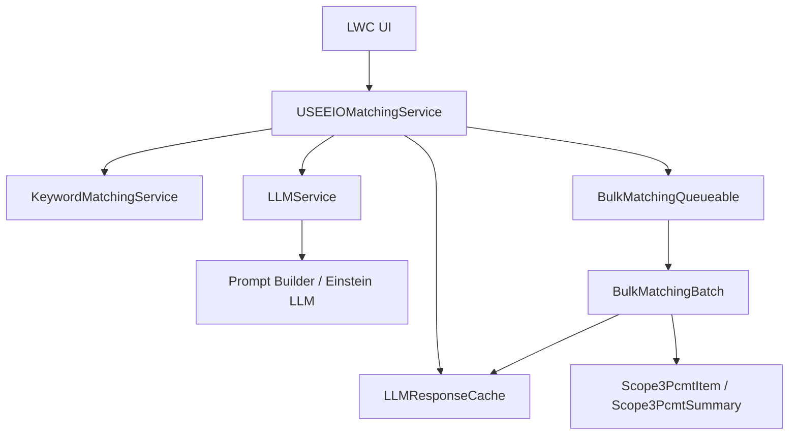

# 🌿 USEEIO Matching Agent

> **A Salesforce Net Zero Cloud accelerator that matches procurement line items to USEEIO-style emissions factors using NAICS 2017 logic, deterministic keyword filtering, and LLM-assisted ranking with response caching.**

[](https://salesforce.com)
[](https://help.salesforce.com/s/articleView?id=sf.net_zero_cloud_intro.htm)
[](https://developer.salesforce.com/docs/platform/lwc/guide)

## 🚀 Quick Deploy

<div align="center">

[](https://githubsfdeploy.herokuapp.com?owner=salesforce-misc&repo=NZC-USEEIOMatchingAgent&ref=main)

**One-click deployment to your Salesforce org**

> **Note:** You may need to authenticate with your Salesforce org during deploy. Alternatively, use the [Salesforce CLI deployment method](#-option-3-salesforce-cli-deployment) below.

</div>

---

## ✨ Features

### 🤖 **Matching Intelligence**

- **Hybrid candidate selection**: Combines deterministic keyword filtering with LLM reasoning to improve NAICS mapping quality.
- **Alternative match suggestions**: Returns top candidates with confidence and reasoning for analyst review.
- **NAICS-aware behavior**: Uses NAICS 2017 definitions while supporting USEEIO model expectations.

### ⚡ **Bulk Processing**

- **Async bulk runs**: Processes procurement summaries via queueable + batch workflows.
- **Progress tracking**: Updates status and counts on summary records for UI polling.
- **Review-friendly output**: Stores match metadata to support analyst verification workflows.

### 💾 **Operational Efficiency**

- **Response caching**: Caches LLM outputs to reduce repeated callouts and cost.
- **Prompt-template driven**: Uses Salesforce Prompt Builder configuration via custom metadata.
- **Salesforce-native architecture**: Keeps UI thin and delegates orchestration to Apex services.

---

## 🚀 Getting Started

### 📋 Prerequisites

Before you begin, ensure you have the following:

- ✅ **Salesforce org** with deployment permissions (Sandbox or Developer Edition recommended)
- ✅ **Net Zero Cloud** installed and relevant procurement/emissions objects available
- ✅ **Salesforce CLI** installed (`sf` or `sfdx`)
- ✅ **Git** installed on your local machine
- ✅ **Einstein Generative AI / Prompt Builder access** enabled in your org

### 🔧 Installation

Choose your preferred deployment method:

#### 🎯 Option 1: One-Click GitHub Deploy _(Recommended)_

Use the **Deploy to Salesforce** button above for a quick deployment experience.

#### 📦 Option 2: Workbench Deployment

For environments where GitHub deploy is restricted:

1. **Clone or download** this repository.
2. **Create** a metadata ZIP package from the `force-app` source.
3. **Open** [Salesforce Workbench](https://workbench.developerforce.com/login.php) and sign in.
4. **Navigate** to Migration → Deploy.
5. **Upload** the ZIP and complete deployment.

#### 🛠️ Option 3: Salesforce CLI Deployment

##### 3.1 Clone the Repository

```bash
git clone https://github.com/salesforce-misc/NZC-USEEIOMatchingAgent.git
cd NZC-USEEIOMatchingAgent
```

##### 3.2 Authorize Your Org

```bash
# Sandbox / production login
sf org login web --alias MyOrg --instance-url https://test.salesforce.com

# Developer edition login
sf org login web --alias MyOrg
```

##### 3.3 Deploy the Metadata

```bash
sf project deploy start --source-dir force-app --target-org MyOrg
```

#### ⚡ Post-Deployment Configuration

After deploying with any method above:

1. **Confirm metadata deployment**
   - Verify classes, LWCs, objects, and custom metadata deployed successfully.
2. **Configure LLM prompt settings**
   - Set prompt template and invocation app values in `LLM_Config__mdt`.
3. **Assign required permissions**
   - Ensure users can access matching UI, Apex actions, and target NZC objects.
4. **Validate the flow**
   - Test a single-item match, then test a bulk run from a procurement summary record.

---

## 🎯 Usage

### 🔍 **Single Item Matching**

1. **Open** a procurement item context in the matching UI.
2. **Run** candidate generation and LLM-assisted matching.
3. **Review** selected factor, confidence score, and alternatives.
4. **Apply** the chosen match to the target record.

### 📦 **Bulk Matching from Summary**

1. **Start** a bulk run from a procurement summary context.
2. **Monitor** status and counts while async processing executes.
3. **Inspect** results and unresolved records for manual review.
4. **Re-run** targeted records when needed after updates.

### 🧠 **Reference Data Context**

- **NAICS 2017** is used for industry-oriented classification and matching hints.
- **USEEIO mappings** support environmental-economic factor alignment.
- **Cache keys** reduce duplicate LLM processing for repeated inputs.

---

## 🏗️ Technical Architecture

This accelerator includes:

- **5 Lightning Web Components** (`useeioMatcher`, `bulkMatchingSummary`, `bulkMatchingSummaryModal`, `factorSetItemLookup`, `customDatatable`)
- **Core Apex orchestration/services** (`USEEIOMatchingService`, `LLMService`, `KeywordMatchingService`, `LLMResponseCache`)
- **Async processing classes** (`BulkMatchingQueueable`, `BulkMatchingBatch`)
- **DTO and response classes** (`MatchingResult`, `AlternativeMatch`, `BulkMatchingResult`, `BulkMatchingStatus`)
- **Custom object and metadata** (`LLM_Response_Cache__c`, `LLM_Config__mdt`)

### Architecture Diagram



### 🧩 **Key Components**

| Component                | Description                                                                |
| ------------------------ | -------------------------------------------------------------------------- |
| `USEEIOMatchingService`  | Main `@AuraEnabled` service layer for single and bulk matching operations. |
| `LLMService`             | Encapsulates prompt-template invocation and response parsing logic.        |
| `KeywordMatchingService` | Produces deterministic NAICS candidates before LLM ranking.                |
| `LLMResponseCache`       | Stores and retrieves previous LLM responses by normalized key.             |
| `BulkMatchingBatch`      | Executes scalable, stateful bulk matching and status updates.              |

---

## 🤝 Contributing

We welcome contributions to improve this accelerator.

1. **Fork** the repository
2. **Create** a branch (`git checkout -b feature/amazing-feature`)
3. **Commit** your changes (`git commit -m 'Add amazing feature'`)
4. **Push** to your branch (`git push origin feature/amazing-feature`)
5. **Open** a Pull Request

### 📝 **Development Guidelines**

- Follow Salesforce Apex/LWC best practices and repository coding standards.
- Include meaningful tests for changed behavior.
- Update docs when adding or changing functionality.
- Open PRs against `main` and request a CODEOWNER review.

---

## 📄 License

This project is licensed under the **Apache License 2.0** - see [LICENSE.txt](./LICENSE.txt) for details.

---

## 🐛 How to Report Bugs

Found a bug or have a feature request? Please use [GitHub Issues](https://github.com/salesforce-misc/NZC-USEEIOMatchingAgent/issues).

When reporting, include:

- Steps to reproduce
- Expected vs. actual behavior
- Salesforce org type/version
- Screenshots, logs, or error text (if available)

## 🆘 Support

- 📚 **Documentation**: Start with [REPOSITORY_SUMMARY.md](./REPOSITORY_SUMMARY.md) and `/documentation`
- 🐛 **Issues**: [GitHub Issues](https://github.com/salesforce-misc/NZC-USEEIOMatchingAgent/issues)
- 💬 **Discussions**: [GitHub Discussions](https://github.com/salesforce-misc/NZC-USEEIOMatchingAgent/discussions)
- 📄 **Contribution and security policies**: [CONTRIBUTING.md](./CONTRIBUTING.md) and [SECURITY.md](./SECURITY.md)

## ⚠️ Disclaimer

**This accelerator is open-source, not an official Salesforce product, and is community-supported.** Salesforce does not provide official support for this accelerator. Use at your own risk and test thoroughly in a sandbox before production deployment.

---
